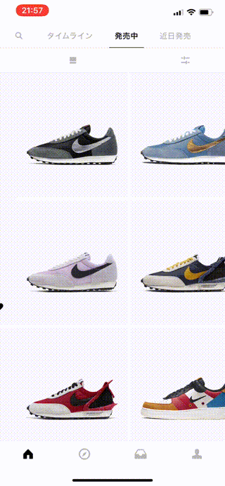

# PolioPager
[![License][license-image]][license-url]
[![Swift Version][swift-image]][swift-url]
[](https://img.shields.io/cocoapods/v/LFAlertController.svg)
[](https://github.com/Carthage/Carthage)

<br>
PolioPager is  the easiest way to use PagerTabStrip including search tab in iOS. Written in pure swift.

(日本語は[こちら](https://qiita.com/yuwd/items/d69ab626d823bf16c1c7))
<br>


<br><br>

## Comparison
SNKRS


<br><br>

↓↓↓↓


PoiloPager


PolioPager enables us to use  PagerTabStrip like SNKRS.
<br><br>

## Installation

#### CocoaPods
You can use [CocoaPods](http://cocoapods.org/) to install `PolioPager` by adding it to your `Podfile`:

```ruby
pod 'PolioPager'
```

To get the full benefits,  import `PolioPager`

``` swift
import PolioPager
```

#### Carthage
Create a `Cartfile` that lists the framework and run `carthage update`. Follow the [instructions](https://github.com/Carthage/Carthage#if-youre-building-for-ios) to add `$(SRCROOT)/Carthage/Build/iOS/PolioPager.framework` to an iOS project.

```
github "YuigaWada/PolioPager"
```


#### Manually
1. Download and drop ```PolioPager``` in your project.  
2. Congratulations!  

<br><br>

## Usage example

```swift
import PolioPager

class ViewController: PolioPagerViewController {

    override func viewDidLoad() {
        super.viewDidLoad()
    }

    override func tabItems()-> [TabItem] {
        return [TabItem(title: "Redbull"),TabItem(title: "Monster"),TabItem(title: "Caffeine Addiction")]
    }

    override func viewControllers()-> [UIViewController]
    {
        let storyboard = UIStoryboard(name: "Main", bundle: nil)

        let viewController1 = storyboard.instantiateViewController(withIdentifier: "searchView")
        let viewController2 = storyboard.instantiateViewController(withIdentifier: "view1")
        let viewController3 = storyboard.instantiateViewController(withIdentifier: "view2")
        let viewController4 = storyboard.instantiateViewController(withIdentifier: "view3")

        return [viewController1, viewController2, viewController3, viewController4]
    }
}
```
<br><br>

## Usage

PolioPager is very simple.

First, you have to create a view controller that extends  ``PolioPagerViewController``

```swift
class ViewController: PolioPagerViewController {
    ...
}
```
<br><br>
*You need at least ``tabItems()`` and ``viewControllers()``.*


### Tab Items

You only have to  prepare TabItem Structure and override ``tabItems()`` .

Widths of each tab are automatically calculated.

```swift
override func tabItems()-> [TabItem] {
    return [TabItem(title: "Redbull"),TabItem(title: "Monster"),TabItem(title: "Caffeine Addiction")]
}
```
### ViewControllers

Override ``viewControllers()`` .

```swift
override func viewControllers()-> [UIViewController]
{
    let storyboard = UIStoryboard(name: "Main", bundle: nil)

    let viewController1 = storyboard.instantiateViewController(withIdentifier: "searchView")
    let viewController2 = storyboard.instantiateViewController(withIdentifier: "view1")

    return [viewController1, viewController2]
}
```

In the above example, ViewControllers are prepared from storyboard.


For those who don't know `` instantiateViewController`` , check below.


<br><br>
↓
<br><br>


<br><br>

### TabItem structure

TabItem is defined as follow.

```swift
public struct TabItem {
    var title: String?
    var image: UIImage?
    var font: UIFont
    var cellWidth: CGFloat?
    var backgroundColor: UIColor
    var normalColor:UIColor
    var highlightedColor: UIColor

    public init(title: String? = nil,
    image: UIImage? = nil,
    font:UIFont = .systemFont(ofSize: 15),
    cellWidth: CGFloat? = nil,
    backgroundColor: UIColor = .white,
    normalColor: UIColor = .lightGray,
    highlightedColor: UIColor = .black){

        self.title = title
        self.image = image
        self.font = font
        self.cellWidth = cellWidth
        self.backgroundColor = backgroundColor
        self.normalColor = normalColor
        self.highlightedColor = highlightedColor

    }
}

```

### Search ViewController

To get input on TextFiled in Search ViewController, you have to adopt ``PolioPagerSearchTabDelegate`` protocol.

For example,

```swift
import PolioPager

class SearchViewController: UIViewController, PolioPagerSearchTabDelegate, UITextFieldDelegate {

    @IBOutlet weak var label: UILabel!


    var searchBar: UIView!
    var searchTextField: UITextField!
    var cancelButton: UIButton!


    override func viewDidLoad() {
        super.viewDidLoad()

        self.searchTextField.delegate = self
    }

    func textField(_ textField: UITextField, shouldChangeCharactersIn range: NSRange, replacementString string: String) -> Bool {
        guard let text = textField.text else{ return true }

        label.text = text
        return true
    }


}
```

<br><br>

## Customization


### Color & Frame & Duration

Check this.


```swift
//color
public var tabBackgroundColor: UIColor = .white

//duration
public var barAnimationDuration: Double = 0.23
```


```swift
public var eachLineSpacing: CGFloat = 5
public var sectionInset: UIEdgeInsets = UIEdgeInsets(top: 0, left: 20, bottom: 0, right: 10)

public var selectedBarHeight: CGFloat = 3
```

<br><br>


```swift
//selectedBar
public var selectedBarMargins: (upper: CGFloat, lower: CGFloat) = (1, 2)

//pageView
public var pageViewMargin: CGFloat = 1

```

<br><br>

### Border

You can draw the border between Tab and pageView.

```swift
public var needBorder: Bool
public var boderHeight: CGFloat = 1
public var borderColor: UIColor = .lightGray
```

<br><br>

### Duration

```swift
public var barAnimationDuration: Double = 0.23 //Default.
```


```swift
public var barAnimationDuration: Double = 0.10
```


<br><br>

### Others

You can also get these Components!

```swift
//MARK: open IBOutlet
@IBOutlet weak open var collectionView: UICollectionView!
@IBOutlet weak open var searchBar: UIView!
@IBOutlet weak open var selectedBar: UIView!
@IBOutlet weak open var pageView: UIView!
@IBOutlet weak open var searchTextField: UITextField!
@IBOutlet weak open var cancelButton: UIButton!
```

For Example, if you want to change the appearance of selectedBar,

```swift
//PolioPagerViewController

override func viewDidLoad() {
     self.selectedBarHeight = 2
     self.selectedBar.layer.cornerRadius = 0
     self.selectedBar.backgroundColor = .gray

     super.viewDidLoad()
 }
```


<br><br>

## More

If you want to change the visible child view controller, use ``moveTo(index: Int)``

```swift
//PolioPagerViewController

moveTo(index: 1)
moveTo(index: nextIndex)
...
```

You can set initial index.

```swift
class ViewController: PolioPagerViewController {

    override func viewDidLoad() {
        self.initialIndex = 1
        ...
    }
}
```


## Todo
- [ ] highlightedColorがうまく機能しない
- [x] Carthageの準備
- [ ] selectedBarのwidthを割合指定可能に
- [x] 日本語版READMEの作成


## Contribute

We would love you for the contribution to **PolioPager**, check the ``LICENSE`` file for more info.


## Others

Yuiga Wada -  [WebSite](https://yuigawada.github.io/)
Twitter         - [@YuigaWada](https://twitter.com/YuigaWada)


Distributed under the MIT license. See ``LICENSE`` for more information.

[https://github.com/YuigaWada/PolioPager](https://github.com/YuigaWada/PolioPager)


[swift-image]:https://img.shields.io/badge/swift-5.0-orange.svg
[swift-url]: https://swift.org/
[license-image]: https://img.shields.io/badge/License-MIT-blue.svg
[license-url]: LICENSE
[codebeat-image]: https://codebeat.co/badges/c19b47ea-2f9d-45df-8458-b2d952fe9dad
[codebeat-url]: https://codebeat.co/projects/github-com-vsouza-awesomeios-com
